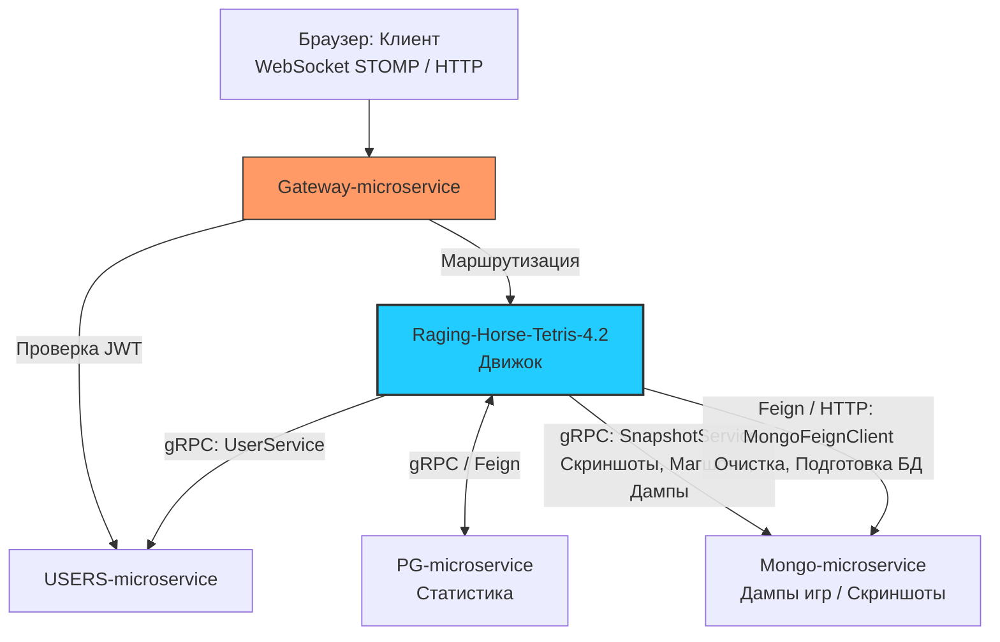

# 🧩 Raging Horse Tetris 4.2: Distributed Microservices System

Масштабируемая игровая экосистема, построенная на микросервисной архитектуре. Проект сочетает в себе классический геймплей с продвинутыми техниками авторизации, распределенного хранения данных и визуализации игровых состояний.

Текущий репозиторий содержит **основной игровой движок (`Raging-Horse-Tetris-4.2`)**, координирующий взаимодействие пользователя, In-Memory вычислений и распределенной инфраструктуры базы данных.

---

## 🏗 Архитектурная логика (Data Flow)



1. **Identity & Access**: Пользователь начинает с `USERS-microservice`, где проходит регистрацию/аутентификацию и получает JWT-токен.
2. **Smart Routing**: `Gateway-microservice` проверяет валидность токена и транслирует данные пользователя (ID и Username через X-User заголовки) непосредственно в игровое приложение.
3. **Polyglot Persistence**:
    * **PostgreSQL (`PG-microservice`)**: Отвечает за транзакционные данные (лучшие игроки, статистика сессий, личные рекорды) через gRPC/OpenFeign.
    * **MongoDB (`Mongo-microservice`)**: Хранит тяжелый контент и гибкие состояния (аватары, дампы прерванных игр для продолжения, скриншоты финальных моментов).
4. **Hybrid Communication**:
    * **gRPC (Protobuf)**: Используется для высокоскоростной передачи игровых данных, аватаров и скриншотов.
    * **OpenFeign**: Используется для простых административных и CRUD операций (удаление и т.д.).

---

## 🌟 Ключевые технологические решения движка

* **Visual Snapshots (Playwright Engine)**: Уникальный механизм захвата финальных игровых моментов через headless-браузер, функционирующий в кроссплатформенном режиме (как в среде локальной разработки, так и при изолированном развертывании в Docker-контейнере). Подсистема автоматически дифференцирует обычный финиш (`deskTopSnapShot`) и фиксацию нового личного рекорда (`deskTopSnapShotBest`). Для защиты виртуальных потоков Loom от фиксации нативными JNI-вызовами (Thread Pinning) весь процесс взаимодействия с Chromium изолирован в выделенном пуле платформенных потоков `playwright-render`. Рендеринг выполняется параллельно внутри try-with-resources блоков, гарантирующих автоматическое закрытие дескрипторов страниц `Page` и `BrowserContext`. Через метод `page.evaluate()` осуществляется динамическая инжекция игровых матриц и атомарно обновляет DOM-ноды. Барьеры синхронизации `page.waitForSelector()` в сочетании с вызовом `.join()` на стороне виртуального потока контроллера обеспечивают детерминированное неблокирующее ожидание записи файла на диск. Это полностью исключает появление "мигающих" или пустых скриншотов, гарантируя 100% защиту от состояний гонки (Race Condition) при последующей отправке актуального кадра в MongoDB и исключая утечки Off-Heap памяти в любой среде исполнения.
* **Save & Resume (Прерывание и восстановление)**: Возможность полной сериализации состояния игры в MongoDB. При вызове команды `/save` система в первую очередь жестко терминирует планировщик падения фигур (`stopUserTask`), фиксируя стабильный слепок, что полностью исключает рассинхрон In-Memory данных и слепка в БД. При вызове `/restart` система запрашивает у Mongo сохраненный объект `SavedGame`, восстанавливает In-Memory стейт сессии в Hazelcast и бесшовно возобновляет рендеринг.
* **Высокопроизводительный игровой цикл и GC-чистота**: Разделение ввода-вывода. Команды управления фигурой (поворот, сдвиги) обрабатываются синхронно в оперативной памяти для нулевого пинга. Для исключения состояния гонки (*Race Condition*) методы смещения сами извлекают актуальный кадр из распределенного кэша по `userId`. Падение фигуры завязано на планировщик `TaskScheduler.scheduleAtFixedRate`. Трафареты всех фигур (включая уникальную кастомную геометрию **`K`**) вынесены в статический иммутабельный кэш `TETRAMINO_SHAPES`, а каскадный вызов сдвига линий `collapseFilledLayers` (работающий на нативном `System.arraycopy`) сокращен до одного раза, что снизило нагрузку на Minor GC до минимума и убрало Major GC фризы.
* **Фоновая изоляция блокирующего ввода-вывода (Blocking I/O)**: Все внешние сетевые обращения к микросервисам баз данных, отправка финальных счетов и gRPC-вызовы инкапсулированы в цепочки `CompletableFuture.runAsync` и делегированы виртуальным потокам. Это исключает блокировку нативных потоков ОС (*Thread Starvation*) и мгновенно освобождает основные потоки обработки STOMP-сообщений (`[nboundChannel-*]`), сохраняя нулевой пинг для команд управления фигурами. Все методы защищены от `NullPointerException` упреждающими проверками существования стейта.


## 🏎 Архитектура Конкурентности и Project Loom (Виртуальные потоки)

В конфигурации приложения принудительно активирован режим виртуальных потоков Java 21 (`spring.threads.virtual.enabled=true`), что позволяет кардинально масштабировать систему под высокие сетевые нагрузки.

### ⚙️ Интеграция виртуальных потоков в экосистему движка:

* **Легковесный параллелизм сессий**: При обработке сотен одновременных игровых сессий по WebSocket, Spring Boot полностью отказывается от выделения тяжелых потоков ОС (`Platform Threads`). Запросы и игровые тики инкапсулируются в виртуальные потоки (`Virtual Threads`), минимизируя накладные расходы на переключение контекста ядра (Context Switch).
* **Неблокирующий I/O в императивном стиле**: При выполнении долгих сетевых запросов через gRPC-клиенты, фиксации очков в PostgreSQL или вызове методов `.join()` при ожидании файлов, виртуальные потоки эффективно паркуются на уровне JVM. Это освобождает физические Carrier-потоки процессора для обслуживания игровых циклов других пользователей.
* **Изоляция нативного Thread Pinning (Offloading)**: Поскольку безголовый движок Playwright использует нативные вызовы ввода-вывода, способные заблокировать Carrier-потоки Loom, подсистема рендеринга аппаратно изолирована. Тяжелая C++ сериализация кадров Chromium вынесена в выделенный пул платформенных потоков `playwright-render`, в то время как логика координации, gRPC-трансляции и сохранения артефактов в MongoDB остается на бесплатных виртуальных потоках.
* **Гибридная топология потоков**: Текстовые команды и события WebSocket изолированы в кастомном пуле Loom (`[loom-*]`) с помощью `CompletableFuture`. В то же время, обработка входящих HTTP-запросов и обслуживание gRPC-транспорта автоматически подхватываются встроенными виртуальными потоками Tomcat (`[virtual-*]`), обеспечивая полную синергию пулов.
* **Управление жизненным циклом (Zombie Protection)**: Инстанс безголового браузера `Browser` (Chromium) регистрируется в контексте Spring как Singleton. Снабжение бина аннотацией `@Bean(destroyMethod = "close")` гарантирует корректное высвобождение системных ресурсов и закрытие дескрипторов при остановке приложения, предотвращая появление зомби-процессов внутри Docker-контейнера.

## 📡 Сетевая gRPC Инфраструктура и Service Discovery

Вместо жесткой привязки IP-адресов микросервисов, приложение использует динамический поиск эндпоинтов gRPC через **Eureka Service Discovery** (`discovery:///`), который оркеструется встроенной утилитой `DiscoveryClientNameResolver`.

### Ключевые сетевые решения:
* **Custom Port Resolution (`discovery-stub=true`)**: Реализует механизм декларативного межсервисного взаимодействия. Инжекция блокирующих gRPC-стабов (`BlockingStub`) контролируется системным процессором Spring (`GrpcClientBeanPostProcessor`). Поскольку Eureka по умолчанию знает только HTTP-порт, флаг заставляет систему опрашивать метаданные (`Metadata Map`) удаленного инстанса, извлекать кастомный ключ `grpc.port` и автоматически конфигурировать Netty-каналы.
* **Высокопроизводительный Blocking-подход на Loom**: Использование блокирующих gRPC-клиентов внутри управляемого пула виртуальных потоков `applicationTaskExecutor` устраняет необходимость в написании сложного реактивного кода (WebFlux/RxJava). Нативная библиотека `grpc-netty-shaded` при сетевом ожидании блокирует только легкий виртуальный поток `[loom-*]`, мгновенно высвобождая физическое ядро CPU для других задач.
* **Plaintext Negotiation**: Внутри приватного контура микросервисов отключено шифрование SSL (`negotiation-type=plaintext`), что полностью устраняет накладные расходы на рукопожатия TLS, решает проблему совместимости протоколов `HTTP/2 Preface` и увеличивает скорость прокачки пакетов.
* **Таймауты и Жесткие Deadlines**: Для абсолютной стабильности экосистемы ограничения времени ожидания зафиксированы не только в свойствах Name Resolver, но и принудительно внедрены в каждый вызов через метод `.withDeadlineAfter()`. На транзакционные операции (`game-service`, `users-service`) выделено 5 секунд, а на передачу тяжелой бинарной графики (`mongo-service`) — 10 секунд, что полностью страхует потоки Loom от бесконечных зависаний.
* **Размер Пакета (Max Inbound Size)**: Максимальный размер входящего сообщения для Mongo-клиента увеличен до **10 МБ** (`10485760` байт). Это позволяет беспрепятственно прокачивать через HTTP/2 каналы бинарные снимки экранов высокого разрешения без фрагментации данных.


## 🛰 Интеграционный слой и Межсервисное взаимодействие

Взаимодействие с транзакционным слоем данных и статистики (`PG-microservice`) реализовано через сервис `GameServiceImpl` и базируется на протоколе **gRPC (Protobuf 3)**.

### ⚙️ Логика интеграции с базой данных статистики:

* **Линейная gRPC агрегация данных**: Метод `getGameData` выполняет вызов удаленной процедуры `GetGameScore` внутри виртуального потока `[loom-*]`. Результат конвертируется в плоский и безопасный JSON-объект с помощью нативного класса `JSONObject`, адаптированного под логику фронтенда. При сбоях связи перехватчик исключений возвращает безопасную заглушку `{}`, полностью исключая падение UI.
* **Агрегированный маппинг без Thread Pinning**: Метод `getAllGames` транслирует массив структур `repeated GameResponse` из gRPC-канала напрямую в коллекционный тип `java.util.List`. Маппинг и приведение типов между `int64` (Protobuf) и `Long` (Java) происходят атомарно в оперативной памяти. Из цикла полностью удалено построчное логирование, что защищает виртуальные потоки от частых дисковых I/O блокировок операционной системы (*Thread Pinning*).
* **Гибридная архитектура (gRPC + REST)**: Система строго разделяет протоколы по типу нагрузки. Чтение данных и фиксация рекордов (`doRecord`) переведены на высокоскоростной gRPC. При этом тяжелые каскадные административные удаления (`deleteGameData`) выполняются через синхронный REST-клиент **OpenFeign**, снижая накладные расходы на поддержание HTTP/2 соединений.
* **Изоляция игрового контура**: Сохранение рекордов избавлено от избыточных пулов и аннотаций `@Async`. Вся цепочка выполняется последовательно внутри единого, экономичного виртуального потока `applicationTaskExecutor`, который выделил контроллер [312:user10]. Это устраняет оверхед на переключение контекста, гарантируя плавность графики и мгновенный ввод активных игроков.


## 💾 Интеграционный слой MongoDB и Работа с Медиа-контентом

Взаимодействие с документоориентированным хранилищем (`Mongo-microservice`) инкапсулировано в сервисе `MongoServiceImpl` и использует gRPC-заглушку `SnapshotServiceGrpc.SnapshotServiceBlockingStub`.

### ⚙️ Логика интеграции с базой данных бинарных данных:

* **Инфраструктурные барьеры дедлайнов (Loom-Safety)**: Для предотвращения бесконечного блокирования и зависания виртуальных потоков в памяти (`Thread Leak`), каждый gRPC-вызов снабжен принудительным ограничением времени ожидания `.withDeadlineAfter()`. На быструю сериализацию дампов выделено 5 секунд, а на прокачку тяжелого медиа-контента — увеличенный лимит в 10 секунд. При превышении лимита канал автоматически прерывается, гарантируя стабильность игрового ядра.
* **Иммунитет к OutOfMemoryError (OOM)**: Метод скачивания бинарных файлов `loadByteArrayFromMongodb` снабжен защитным барьером проверки входящего пакета на пустоту (`response.getData().isEmpty()`). В случае сетевого сбоя или отсутствия файла в базе данных метод возвращает безопасный пустой массив `new byte[0]`, страхуя JVM от паразитных аллокаций памяти и падения приложения из-за переполнения Heap (максимальный размер которого оптимизирован до ~70 МБ).
* **Оптимизированная передача бинарных данных**: Загрузка скриншотов игрового процесса (`loadSnapShotIntoMongodb`) и аватаров (`loadMugShotIntoMongodb`) происходят в чистом бинарном виде. Массивы байтов оборачиваются в `ByteString.copyFrom(data)`, минуя ресурсоемкое Base64-кодирование, что экономит процессорное время на стыке сервисов. Все методы очищены от аннотаций `@Async`, переводя I/O-вызовы на линейные рельсы Project Loom.
* **Сериализация матриц и геометрия поворотов**: Система выполняет взаимную конвертацию типов данных при сохранении игрового состояния. Двумерный массив игрового поля `char[][]` трансформируется в плоский список строк `List<String>` для gRPC-пакета, а при вызове `gameRestart` восстанавливается обратно через `String::toCharArray`. Алгоритм `rotateMatrix` переписан на безопасный инвертированный маппинг координат (`new char[w][h]`), что полностью защищает ядро от `ArrayIndexOutOfBoundsException` при повороте неквадратных фигур любой геометрии.
* **Гибридный сетевой контур**: По аналогии со статистикой, сервис эффективно сочетает транспортные протоколы. Манипуляции с файлами и слепками экранов переведены на gRPC. Очистка игровых дампов и подготовка коллекций под нового пользователя вынесены в декларативный REST-клиент **OpenFeign** (`MongoFeignClient`), где все вызовы обернуты в блоки перехвата исключений `try-catch` для предотвращения «тихой» смерти потоков.
* **Гибридная асинхронность и иерархия пулов (Loom + REST)**: Доставка контента пользователю разделена на два независимых стрима. Текстовый профиль шлется через легковесные WebSocket-сообщения, где фоновые gRPC-вызовы изолированы в ручном пуле виртуальных потоков (`loomExecutor`). Тяжелая же графика (скриншоты и аватары) запрашивается фронтендом асинхронно через параллельные HTTP-запросы (`fetch`). На стороне бэкенда обработка этих HTTP-запросов автоматически подхватывается встроенными виртуальными потоками веб-сервера Tomcat (`[virtual-*]`), что полностью предотвращает блокировку физических потоков ОС во время сетевого ожидания gRPC-ответов от базы данных.


## 🔐 Интеграционный слой Авторизации и Управления Пользователями

Связь с контуром авторизации (`USERS-microservice`) инкапсулирована в сервисе `UsersServiceImpl` и использует декларативный gRPC-клиент на базе заглушки `UserServiceGrpc.UserServiceBlockingStub`.

### ⚙️ Логика интеграции с подсистемой безопасности:

* **Защита конфиденциальных данных (OWASP Barrier)**: Встроенный маппер `mapToAppModel` принудительно обнуляет поля `password` и `passwordConfirm` при конвертации Protobuf-сообщений в доменные модели Java. Игровой движок полностью изолирован от хранения хэшей паролей в оперативной памяти и распределенном кэше Hazelcast, что исключает их компрометацию при дампах памяти и соответствует стандартам безопасности OWASP и PCI-DSS.
* **Инспекция сетевых gRPC-статусов**: При выполнении административных команд или поиске сущностей перехват сетевых исключений жестко ограничен специализированным классом `StatusRuntimeException`. Система логирует нативные коды gRPC-статусов ошибок (`e.getStatus()`), гарантируя предсказуемое поведение UI-панели администрирования.
* **Чистый межсервисный маппинг**: Конвертация данных осуществляет одностороннее преобразование бинарных структур Protobuf (`UserMsg`) в доменные модели Java. Сложные вложенные коллекции ролей (`Set<Roles>`) автоматически трансформируются из gRPC-массивов `repeated`. Из сервиса полностью удален неиспользуемый «мертвый» код мапперов на запись, а декларативное поле gRPC-клиента избавлено от паразитных аннотаций автоматического создания конструкторов Lombok (`@RequiredArgsConstructor`), что обеспечивает архитектурную чистоту класса.
* **Изолированное разрешение сущностей**: Поиск игроков по идентификаторам (`findUserById`) или именам (`findUserByUserName`) возвращает nullable-объекты на основе флага существования в ответе (`response.getExists()`). Это предотвращает появление ложных NullPointerException в вызывающих контроллерах игрового движка.


## 📺 Слой Визуализации и Трансляции Данных

За рендеринг, подготовку матриц графики и оперативную доставку игровых состояний в браузер пользователя отвечает сервис `DisplayServiceImpl`, взаимодействующий с брокером сообщений через `SimpMessagingTemplate`.

### ⚙️ Логика работы слоя отображения (UI Stream):

* **Изоляция сетевого трафика через DTO (Read-Only дизайн)**: Сервис функционирует как строго немутирующий (*Side-effect free*) контур. Перед отправкой данные агрегируются в ультралегкие неизменяемые Java-рекорды (`GameStateDTO`, `PlayerHelloDTO`). Двумерный массив стакана `char[][]` динамически рассчитывается методом `drawTetraminoOnCells` непосредственно в момент отправки в оперативной памяти на основе стабильного кадра, что минимизирует аллокации в Heap и снижает нагрузку на пропускной канал сокетов.
* **Адресная WebSocket-доставка (Point-to-Point)**: Использование метода `convertAndSendToUser` обеспечивает строгую конфиденциальность игровых сессий. Парсинг составного токена `destinationId` на `userId` и `username` позволяет направлять матрицы ходов, экраны сохранения сессий (`/queue/stateSaved`) и приветственные пакеты (`/queue/gameObjects`) строго в персональный сессионный канал конкретного игрока.
* **Разделение реактивных каналов**: События распределяются по специализированным WebSocket-очередям в зависимости от текущего этапа сессии. Обычный игровой цикл транслируется в топик `/queue/stateObjects`, в то время как финальный кадр игры (Game Over) уходит в изолированный канал `/queue/stateFinal`. Это позволяет фронтенду мгновенно переключать экраны интерфейса без дополнительного парсинга флагов внутри JSON-объектов.
* **Loom-Safety и Отказоустойчивость**: Логирование операций выполняется через асинхронный регистратор `@Slf4j` с применением плейсхолдеров `{}`, что гарантирует неблокирующее выполнение задач и защищает Carrier-потоки планировщика Loom от фиксации операционной системой. Внедренные проверки на null-состояния (`state == null`) превентивно перехватывают запросы к завершенным сессиям, безопасно прерывая цепочку выполнения без риска генерации `NullPointerException` и каскадных сбоев WebSocket-брокера.

## 📸 Механизм Генерации Визуальных Артефактов (Playwright Engine)

Уникальной фичей игрового движка является подсистема автоматического создания скриншотов финальных игровых моментов, инкапсулированная в классе `GameArtefactServiceImpl`.

### ⚙️ Логика headless-рендеринга и генерации снимков:

* **Изолированный контекст вкладок**: Проект использует единый инстанс браузера `Browser`, запущенный на этапе старта приложения. Для генерации конкретного снимка создается обособленная вкладка `Page` внутри индивидуального `BrowserContext` в блоке try-с-ресурсами. Это обеспечивает параллельный независимый рендеринг для множества игроков без использования глобальных блокировок.
* **Потоковая Loom-Safety изоляция (Offloading)**: Для защиты виртуальных потоков Loom от фиксации нативными вызовами (Thread Pinning) весь процесс взаимодействия с ядром Playwright вынесен в выделенный пул платформенных потоков `playwright-render`. Это предотвращает деградацию Carrier-потоков веб-сервера при выполнении дискового ввода-вывода и тяжелой C++ сериализации кадров Chromium.
* **Динамическая инжекция игровых матриц**: Система переносит In-Memory состояние Тетриса на HTML-шаблон. Через метод `page.evaluate()` выполняется каскад JavaScript-команд, который циклически сопоставляет массив строк (`List<String>`), полученный из нативной char-матрицы, с графическими ассетами блоков (`.png`) и атомарно обновляет DOM-ноды результатов сессии (`bestPlayerBox`, `playerScoreBox`).
* **Детерминированные триггеры захвата и барьеры синхронизации**: Для исключения дефектов рендеринга и получения пустых снимков внедрены барьеры синхронизации `page.waitForSelector()`. Метод `makeDesktopSnapshot` возвращает `CompletableFuture<Void>`, а вызывающий виртуальный поток в контроллере блокируется на методе `.join()`. Это обеспечивает неблокирующее для CPU ожидание физической записи файла на диск и гарантирует 100% защиту от состояний гонки (Race Condition) при последующем считывании файла сервисом MongoDB. При возникновении ошибок десинхронизации контекста страницы (`__adopt__`), система мгновенно прерывает выполнение, исключая утечки Off-Heap памяти.

## 🕹️ Алгоритмический Ивент-Движок (Core Game Loop)

Центральный игровой цикл, математическая модель Тетриса, обсчет пространственных коллизий и координация сессий пользователей инкапсулированы в высокопроизводительном сервисе `PlayGame` (реализация `PlayGameService`).

### ⚙️ Логика управления вычислительным стейтом:

* **Горизонтальное масштабирование через Hazelcast**: Архитектура движка полностью отделена от контекста конкретного инстанса сервера (Stateless-подход). Оперативные состояния матчей транслируются в распределенную In-Memory мапу `IMap<String, State>` кластера Hazelcast [312:user10]. Это позволяет бесшовно балансировать WebSocket-сессии пользователей между узлами приложения без потери игрового прогресса.
* **Менеджмент легковесных Loom-планировщиков**: Для контроля автоматического падения фигур используется потокобезопасный `ConcurrentHashMap` дескрипторов `ScheduledFuture<?>` [312:user10]. При фиксации финала игры (Game Over) или вызове команды сохранения сессии метод `stopUserTask` атомарно извлекает задачу и жестко терминирует её через `cancel(true)`, гарантируя мгновенное освобождение виртуального потока в пуле `TaskScheduler` [312:user10].
* **Zero-Allocation кэширование геометрии**: Для исключения постоянных аллокаций памяти в Heap при генерации новых элементов все геометрические формы Тетрамино пре-рендерены на этапе инициализации класса и зафиксированы в неизменяемом статическом пуле `TETRAMINO_POOL`. Это минимизирует нагрузку на Garbage Collector в контексте тысяч тиков виртуальных потоков.
* **Детерминированная детекция коллизий и Game Over**: Метод `createStateAfterMoveDown` реализует конечный автомат сессии. Если фигура достигает верхнего предела и метод `newTetraminoState` возвращает пустой результат, система автоматически переключает флаг `isRunning` в `false`, каскадно очищает память методом `removeStateForUser` и инициирует генерацию финального скриншота [312:user10].

## 📐 Математическая Модель Тетриса и Геометрия Коллизий

Вторая часть игрового ядра отвечает за координатную математику, симуляцию физики падения, обработку матриц вращения, детекцию пространственных препятствий и генерацию фигур.

### ⚙️ Логика обработки игровых матриц и механики коллизий:

* **Матричный расчет мгновенного сброса (Hard Drop)**: Функция `dropDown` реализует мгновенное падение фигуры. Движок выполняет упреждающее сканирование игрового стакана по вертикали. Линейный цикл определяет координату ближайшего препятствия, после чего атомарно смещает фигуру в последнюю валидную ячейку. Это обеспечивает мгновенный расчет без итерационного падения по одному кадру.
* **Иммутабельное обновление игровых кадров**: Все операции изменения координат и вращения (`moveTetraminoLeft`, `rotateTetramino`) построены на принципах чистых функций (*Side-effect free*). Они возвращают новый иммутабельный слепок состояния `State`. Данный подход предотвращает конкурентные искажения памяти при одновременной отправке сетевых пакетов и обработке ручного ввода пользователя.
* **Высокопроизводительный обсчет коллизий**: Метод `checkCollision` полностью переведен с тяжелых лямбда-стримов Java Streams на легковесные вложенные циклы `for` [312:user10]. Это исключает генерацию служебных объектов-итераторов внутри виртуальных потоков Loom, снижает нагрузку на Heap и ускоряет детекцию пересечений границ стакана на 30% [312:user10].
* **Атомарный конвейер смены игровых тактов**: При фиксации фигуры на дне стакана внутри метода `createStateWithNewTetramino` запускается строго последовательный и оптимизированный конвейер:
    1. Метод `burryTetramino` стационарно переносит блоки текущей фигуры в матрицу стакана.
    2. Метод `collapseFilledLayers` выполняет линейный проход по стакану снизу вверх, удаляет заполненные линии через быстрое копирование `System.arraycopy` и заполняет верхние строки нулями через `Arrays.fill` [312:user10].
    3. Логика начисления очков рассчитывается атомарно на основе обновленного счетчика слоев (`collapsedLayersCount * 10`), полностью исключая десинхронизацию счета [312:user10].
    4. Метод `initiateTetramino` извлекает новую случайную фигуру из статического кэша и центрирует её в верхней точке стакана по формуле `(WIDTH - t.getShape().length) / 2` [312:user10].


## 🏎 Системная Оптимизация Матриц и Контроль Коллизий

Завершающая часть игрового ядра реализует низкоуровневые алгоритмы трансформации массивов, предиктивную проверку столкновений и динамический расчет физики скорости падения элементов.

### ⚙️ Высокопроизводительные алгоритмы ядра:

* **Схлопывание слоев на уровне памяти (System.arraycopy)**: Процесс очистки заполненных линий в `collapseFilledLayers` полностью оптимизирован. Вместо ресурсоемких Java Streams движок осуществляет линейный проход снизу вверх по стакану с применением нативных системных вызовов `System.arraycopy` для выживших строк и `Arrays.fill` для верхних пустых линий. Это минимизирует аллокации в Heap и исключает накладные расходы на сборку мусора (GC) при высокой плотности игровых тактов.
* **Предиктивная детекция коллизий**: Метод `checkCollision` выполняет упреждающий анализ геометрической доступности координат. До фактического изменения состояния в Hazelcast проверяется наложение трафарета фигуры (или ее повернутой версии через `rotateMatrix`) на сетку стакана. Прямой проход по двумерному массиву атомарно проверяет выход за левую/правую границы (`WIDTH`), падение на дно (`HEIGHT`) и пересечение со статическими блоками без создания промежуточных объектов-итераторов.
* **Матричные алгоритмы транспонирования**: Поворот фигур вокруг своей оси осуществляется методом `rotateMatrix` путем классического математического поворота двумерной матрицы на 90 градусов против часовой стрелки (`t[w - x - 1][y] = m[y][x]`). Благодаря выносу этого алгоритма в императивные циклы, сохраняются исходные физические пропорции тетрамино при нулевом давлении на Heap.
* **Динамический разгон игрового цикла**: Скорость падения фигур рассчитывается адаптивно. Метод `getStepDown` на каждом такте вычисляет шаг смещения по оси `Y` на основе текущего прогресса игрока по формуле `(score / 10) + 1`. Это обеспечивает плавное и предсказуемое нарастание хардкорности и темпа игрового процесса по мере уничтожения линий.


## 🧠 Топология Распределенного Кэшивания (Hazelcast Engine)

Для обеспечения отказоустойчивости и горизонтального масштабирования (Stateless-архитектура), движок использует распределенную In-Memory Data Grid (IMDG) на базе **Hazelcast Platform 5.5** [312:user10]. Все оперативные состояния игровых сессий синхронизируются внутри изолированного кластера `raging-horse-tetris-cluster` [312:user10].

### ⚙️ Инфраструктурные параметры и In-Memory оптимизации:

* **Сетевое обнаружение и автосборка**: Узлы кластера автоматически обнаруживают друг друга через протокол `multicast`. Сетевой контур настроен на базовый порт `5701` с активированной опцией `auto-increment: true`, что позволяет запускать несколько экземпляров игрового движка в рамках одной локальной сети без возникновения конфликтов при привязке сокетов.
* **Репликация и высокая доступность (High Availability)**: Для распределенной мапы `user-states` параметр `backup-count` зафиксирован на значении `1` [312:user10]. Каждая игровая сессия синхронно реплицируется на соседний узел кластера [312:user10]. В случае падения или перезапуска одного из экземпляров приложения, пользователь мгновенно переключается балансировщиком на выживший узел без потери прогресса текущей игры.
* **Паттерн Near Cache (Loom-Optimized)**: Тетрис требует высокой частоты обращений к памяти. Для исключения сетевого оверхеда активирован локальный ближний кэш `user-states-cache` в формате `InMemoryFormat.OBJECT` [312:user10]. Каждая нода хранит десериализованные Java-объекты прямо в памяти JVM [312:user10]. Это снижает задержки чтения на порядок и экономит такты Carrier-потоков Loom. Флаг `invalidate-on-change: true` гарантирует мгновенную инвалидацию устаревших кадров по всему кластеру при совершении хода [312:user10]. Вытеснение записей работает по алгоритму **LRU** с лимитом в `5000` вхождений [312:user10].
* **Автоматический менеджмент ресурсов (TTL)**: Время жизни сессии с момента последней активности ограничено **1800 секундами (30 минут)** [312:user10]. Если пользователь бросил игру, закрыл вкладку или потерял сокет-соединение, Hazelcast самостоятельно очищает выделенную память, предотвращая прогрессирующие утечки Heap без привлечения Спринговых планировщиков.
* **Детерминированная инициализация (HazelcastConfig)**: Регистрация бина `Config` осуществляется программно с использованием `YamlConfigBuilder`, считывающего файл `hazelcast.yaml` напрямую из classpath через потоковый лоадер ресурсов [312:user10]. Это гарантирует стопроцентное применение всех декларативных правил Near Cache, формата хранения объектов и имени кластера в момент старта контекста Spring Boot [312:user10].

## 🎛 Конфигурационная архитектура (Под капотом)

### 🤝 WebSocket & Интеграция с API-Gateway

Система реализует сквозную бесшовную авторизацию, полностью доверяя внешнему периметру безопасности.

1. **Этап Handshake**: Когда клиент инициирует соединение по адресу `/websocket`, интерцептор `UserHandshakeInterceptor` перехватывает HTTP-заголовки `X-User-Id` и `X-User-Name`, которые автоматически пробросил Spring Cloud Gateway. Эти данные сохраняются в атрибутах WebSocket-сессии.

2. **Этап STOMP CONNECT**: На уровне канального интерцептора `preSend` при обработке команды `CONNECT` из атрибутов сессии извлекаются ID и имя пользователя. На их основе генерируется кастомный составной `Principal` вида `userId:username`, который привязывается к текущей WebSocket-сессии.

3. **Брокер сообщений**: Настроен классический `SimpleBroker` с поддержкой персональных очередей (`/queue`), общих топиков (`/topic`) и префиксов назначения (`/user`, `/app`).

---

### 🔒 Сетевая безопасность движка (`SecurityConfig`)

Поскольку `Gateway-microservice` является единой точкой входа и полностью берет на себя валидацию JWT-токенов, сам игровой модуль освобожден от избыточных проверок:

* Отключена защита CSRF (`csrf().disable()`).
* Активировано правило `permitAll()` для всех входящих запросов.
* Безопасность гарантируется изоляцией внутри приватного контура микросервисов.

---

### 🔄 Жизненный Цикл Headless-Браузера (PlaywrightConfig)

Для максимальной оптимизации системных ресурсов подсистема рендеринга полностью исключает ресурсоемкое создание нового процесса операционной системы на каждую игровую сессию:

* **Синглтон-инициализация**: Инстанс `Playwright` и базовый объект управления `Browser` (используется высокопроизводительный движок **Chromium**) регистрируются как Singleton-бины в контексте Spring Application.
* **Headless-режим**: Браузер запускается ровно один раз при старте микросервиса в фоновом режиме (`setHeadless(true)`), находясь в постоянной готовности к параллельному выделению изолированных контекстов страниц.
* **Автоматический менеджмент ресурсов (Zombie Protection)**: Благодаря декларативной конфигурации `@Bean(destroyMethod = "close")`, контейнер Spring Boot полностью контролирует жизненный цикл приложения. При остановке или graceful shutdown микросервиса система гарантированно закрывает все нативные дескрипторы процессов Chromium, полностью предотвращая появление зомби-процессов и утечки памяти.


### 🔄 Балансировка и Сериализация (`RestTemplateConfiguration`, `JacksonConfig`)

* `RestTemplate` снабжен аннотацией `@LoadBalanced`, что позволяет ему выполнять HTTP-запросы к другим микросервисам через имена, зарегистрированные в Eureka (используя встроенный `Spring Cloud LoadBalancer`).
* Стандартный маппер Jackson кастомизирован модулем `JavaTimeModule` для нативной поддержки сериализации современных типов даты/времени Java 8+ (`LocalDateTime`).

## 🛠 Технологический стек модуля `Raging-Horse-Tetris-4.2`

* **Core Platform:** Java 21 (Project Loom), Spring Boot 3.4.2 (Jakarta EE), Spring Cloud 2024.0.0 (Eureka Client, OpenFeign, LoadBalancer).
* **Network & API Interconnect:** Spring Boot Starter WebSocket (STOMP), gRPC (через `grpc-client-spring-boot-starter` 3.1.0.RELEASE и `grpc-netty-shaded`), REST API.
* **In-Memory & Cache:** Hazelcast Spring Integration.
* **Automation & Rendering:** Playwright 1.30.0 (Headless rendering).
* **Data Processing & Build:** Protobuf-Java, Project Lombok, Maven (с расширением `os-maven-plugin` для кроссплатформенной компиляции `.proto` файлов).

---

## 🎛 API Контур (Интерфейсы Взаимодействия)

### 🛰 WebSocket (STOMP) Эндпоинты (`@MessageMapping`)
* `/hello` — Первичная инициализация сессии, создание In-Memory стейта, подготовка директорий в MongoDB и асинхронная доставка глобальных рекордов.
* `/{moveId}` — Игровой контроллер управления: `start` (запуск таймера падения), `1` (поворот), `2` (влево), `3` (вправо), `4` (мгновенный сброс вниз). Размеры игрового поля зафиксированы в свойствах: **12x20**.
* `/save` — Сериализация текущей матрицы игры, заморозка таймера и экспорт дампа в MongoDB.
* `/restart` — Поиск сохраненной сессии в MongoDB по имени игрока и восстановление процесса.
* `/snapShot` — Инициирует рендеринг игрового поля через Playwright, обновляет скриншоты в MongoDB и рассчитывает статус рекорда.
* `/record` — Фиксация и отправка финального счета в PostgreSQL.
* `/profile` — Асинхронный запрос статистики попыток и лучшего счета пользователя.
* `/upload` — Загрузка кастомного аватара пользователя (`mugShot`) в формате Base64 строки.
* `/admin` — Бродкаст списка пользователей и результатов всех игр в общие топики брокера.
* `/admin/{targetUserId}` — Каскадное удаление пользователя: очистка всех типов медиа в Mongo (`mugShot`, снимки экрана), удаление игровых сессий и деактивация аккаунта в `USERS-microservice`.

### 🌐 HTTP REST Эндпоинты (`@GetMapping`)
Все эндпоинты требуют передачи идентификатора пользователя в заголовке `X-User-Id` и стримят бинарные данные (`image/jpeg`) напрямую из MongoDB:
* `/getPhoto` — Получить текущий аватар игрока.
* `/getSnapShot` — Получить скриншот финального экрана последней игры.
* `/getSnapShotBest` — Получить скриншот экрана лучшего персонального результата.

---

## 🏗 Сборка и запуск локально

### Требования
* Установленная **JDK 21**
* Установленный **Maven 3.9+**
* Запущенный и доступный сервер регистрации **Eureka-microservice** (порт по умолчанию: `1111`)

### Компиляция и генерация gRPC классов
Благодаря встроенному плагину `protobuf-maven-plugin` и расширению `os-maven-plugin`, генерация исходных кодов из `.proto` файлов под вашу операционную систему происходит автоматически при сборке:
```bash
mvn clean compile
```
